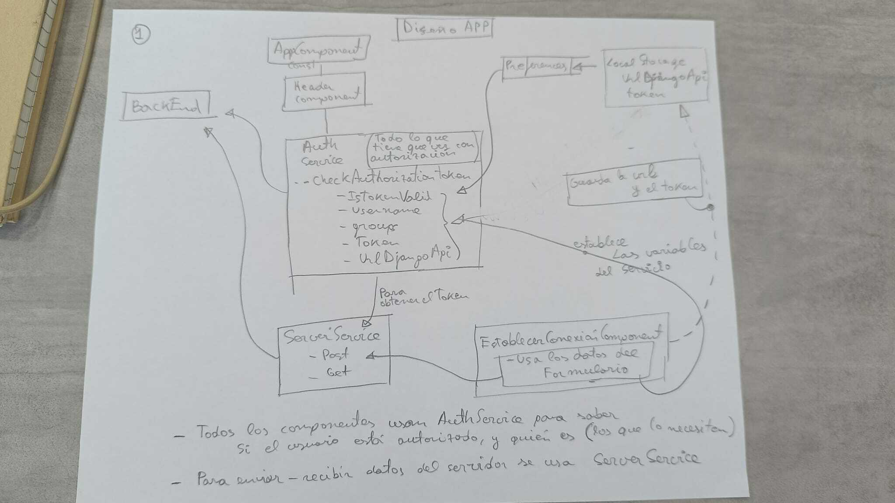

# Bienvenido a la app móvil del proyecto Metatierras Colombia

Metatierras Colombia es un proyecto ADSIDEO financiado por el área de cooperación al desarrollo de la <a href='https://www.upv.es/'>Universitat Politècnica de València</a>, 
y realizado en colaboración con la <a href='https://www.forjandofuturos.org/'> Fundación Forjado Futuros</a>, y con la <a href="https://www.acpp.com/">Asamblea de Cooperación por la Paz</a>.

El objetivo del proyecto es diseñar software libre para la agilización de la regularización 
de tierras rústicas en Colombia.

Este repositorio contiene parte de la implementación del diseño de una aplicación móvil que captura imágenes y coordenadas, según el modelo LADM-COL.

Esta aplicación guarda los datos capturado en el móvil hasta que se envían a un servidor para ser estudiados por expertos. La implementación de la API e el servidor se puede encontrar en <a href="https://github.com/joamona/metatierrascol-api">código fuente de la API</a>.

# Detalles técnicos de la implementación

La app ha sido realizada con Angular 17 + Capacitor.

## Esquema de autenticación

  